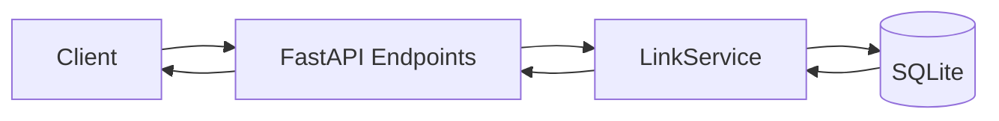

# 05 - Architecture Overview

## Components

1. API layer (`app/main.py`)
- FastAPI routing, request validation, error mapping.

2. Domain layer (`app/service.py`)
- URL creation/resolution, analytics aggregation, lifecycle control.

3. Persistence layer (`app/db.py`)
- SQLite connection lifecycle, schema bootstrap, transaction boundaries.

4. Contract layer (`app/models.py`)
- Pydantic request/response schemas.

5. Configuration layer (`app/config.py`)
- Environment-driven service configuration.

6. Quality layer (`tests/`)
- Regression and behavior validation tests.

## Control flow

## Key design decisions

1. SQLite for reproducible local execution.
2. Idempotent create by `(original_url_hash, created_by)` lookup.
3. Secure code generation via `secrets` for short-code entropy.
4. Bounded retries for short-code collisions.
5. In-memory rate limiting as prototype-level abuse control.
6. Hashed IP analytics to reduce privacy exposure.

## Operational modes

1. Greenfield: build new functionality from zero state.
2. Brownfield: impact-first enhancements on an existing implementation.
3. Ambiguous: resolve intent explicitly before implementation.
